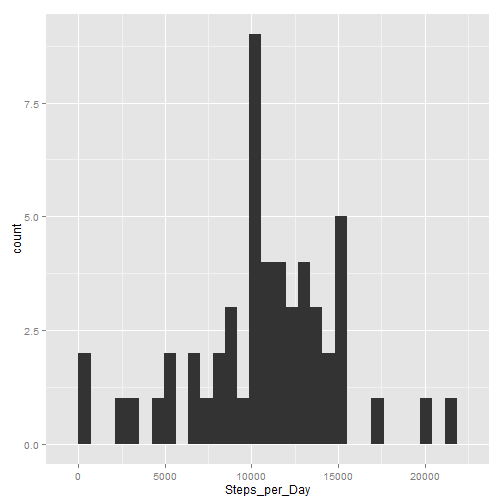
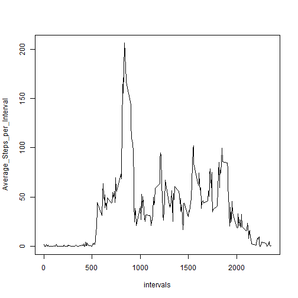
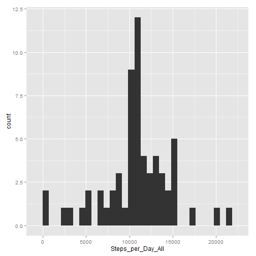

# Reproducible Research: Peer Assessment 1


## Loading and preprocessing the data

```r
# Load Libraries
library(ggplot2)
library(lattice)

# Load the activity data
activity <- read.csv("activity/activity.csv")

# Format the Date column
activity[, 2] <- as.Date(activity[, 2], format = "%Y-%m-%d")

# Eliminate rows with NA values
a <- activity[complete.cases(activity), ]
```


## What is mean total number of steps taken per day?

```r

# Summarize steps per day
Steps_per_Day <- tapply(a$steps, format(a$date, "%Y-%m-%d"), sum)

# Plot Steps per day
qplot(Steps_per_Day)
```

```
## stat_bin: binwidth defaulted to range/30. Use 'binwidth = x' to adjust this.
```

 

```r

# Mean Steps per day
mean(Steps_per_Day, na.rm = T)
```

```
## [1] 10766
```

```r

# Median Steps per day
median(Steps_per_Day, na.rm = T)
```

```
## [1] 10765
```


## What is the average daily activity pattern?


```r
# Summarize steps per interval
Average_Steps_per_Interval <- tapply(a$steps, a$interval, mean)

# Get list of intervals
intervals <- unique(a$interval)

# plot intervals
plot(intervals, Average_Steps_per_Interval, type = "l")
```

 

```r

# Max Steps
max(Average_Steps_per_Interval)
```

```
## [1] 206.2
```

```r

# Time Interval
names(Average_Steps_per_Interval[match(max(Average_Steps_per_Interval), Average_Steps_per_Interval)])
```

```
## [1] "835"
```


## Imputing missing values


```r

# Number of NA's
sum(is.na(activity$steps))
```

```
## [1] 2304
```

```r

### Strategy: 1.Replace missing values with interval averages.  2.If there are
### still missing values, replace them with the date average

# Create a new data table for replacing missing tables
b <- activity

# Create intervals and days tables
intervals <- as.data.frame(as.table(Average_Steps_per_Interval))
days <- as.data.frame(as.table(Steps_per_Day))

# 1.
for (i in 1:nrow(b)) {
    
    # replace NA with average interval
    if (is.na(b$steps[i])) {
        # Get interval
        inter <- as.character(b$interval[i])
        # Match interval
        index <- match(inter, intervals[, 1])
        # 
        b$steps[i] <- Average_Steps_per_Interval[index]
    }
}

# 2.
for (i in 1:nrow(b)) {
    
    # if still NA replace with average of date
    if (is.na(b$steps[i])) {
        # Get interval
        inter <- as.character(b$date[i])
        # Match interval
        index <- match(inter, days[, 1])
        # 
        b$steps[i] <- Steps_per_Day[index]
    }
}

# New Summarry Data set
Steps_per_Day_All <- tapply(b$steps, format(b$date, "%Y-%m-%d"), sum)

# Plot new summary set
qplot(Steps_per_Day_All)
```

```
## stat_bin: binwidth defaulted to range/30. Use 'binwidth = x' to adjust this.
```

 

```r

# Mean
mean(Steps_per_Day_All, na.rm = T)
```

```
## [1] 10766
```

```r

# Median
median(Steps_per_Day_All, na.rm = T)
```

```
## [1] 10766
```

```r

# By replacing the missing values with averages of other factors, we have
# not moved the mean, but rather moved the median in towards the mean. We
# have made the distribution less skewed.It has increased the total number
# of steps per day on average because it has added values where there were
# none before
```


## Are there differences in activity patterns between weekdays and weekends?


```r

# Add day name to data frame
b$dayType <- weekdays(b$date)

# Convert day name to day type
for (i in 1:nrow(b)) {
    if (b$dayType[i] == "Saturday" | b$dayType[i] == "Sunday") {
        b$dayType[i] <- "Weekend"
    } else {
        b$dayType[i] <- "Weekday"
    }
}

# Find the mean of steps per interval for weekend
c <- subset(b, dayType == "Weekend")
DFc <- aggregate(steps ~ interval + dayType, data = c, FUN = mean)

# Find the mean of steps per interval for weekday
d <- subset(b, dayType == "Weekday")
DFd <- aggregate(steps ~ interval + dayType, data = d, FUN = mean)

# Combine weekend and weekday summary data
DF <- rbind(DFc, DFd)

# Plot summary data
xyplot(DF$steps ~ DF$interval | DF$dayType, ylab = "Number of Steps", xlab = "Interval", 
    type = "l", layout = (c(1, 2)))
```

 


